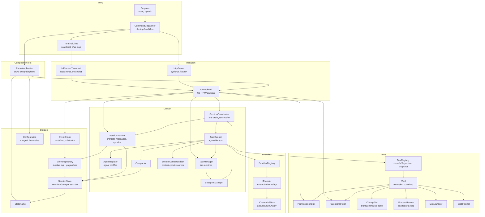
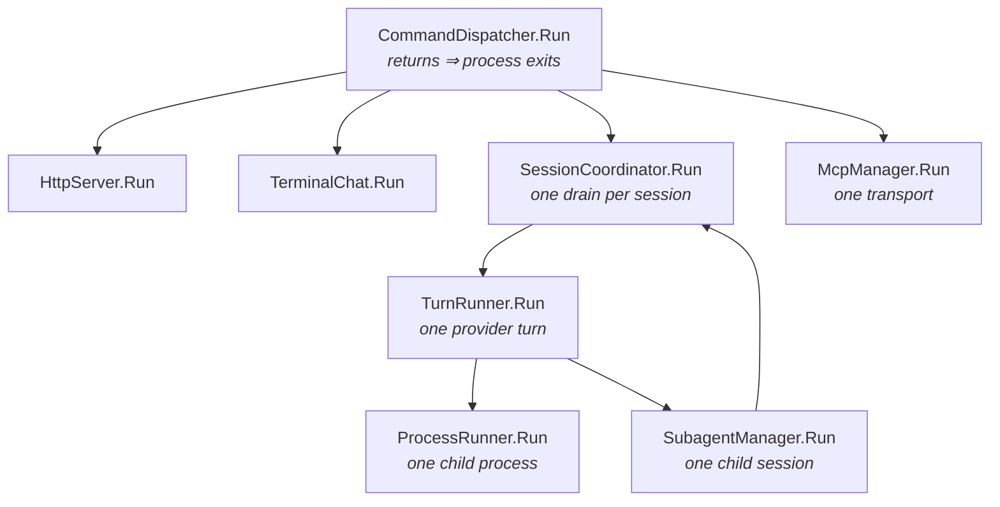

# Top-Level Architecture

**Status: draft, first pass. Not yet reviewed.** This is the level-1 deliverable
of the plan gate (MIGRATION.md §0). It names the top-level classes and how they
connect. It does not yet decompose any of them, and no component may be ported
until its entry in [components.md](components.md) is filled in from this.

Derived by reading the Go tree, not invented: the block set below is
`app.App`'s field list plus what `httpapi.DomainBackend` carries. Where the Go
name is a package-level `Service`/`Registry`/`Manager`, the C# name says what it
manages, because in C# the namespace no longer disambiguates it.

## Blocks

## Run tree

`AGENTS.md` requires one top-level `Run` that parents every other. The block
graph above is *who calls whom*; this is *whose lifetime bounds whose*. A block
absent here is passive — it is called, it does not run.

Cancellation flows down; nothing flows up. A parent `Run` does not return while
a child `Run` is in flight, so there is no abandoned `Task` to leak and no
`Stop` method anywhere.

## Blocks to Go packages

Rank is migration order. A block may not be built before anything it depends on.

| Rank | C# class | Absorbs (`internal/…`) |
| --- | --- | --- |
| 1 | `StatePaths` | `appdirs`, `project`, `id`, `atomicfile`, `processidentity` |
| 1 | `Configuration` | `config`, `mode` |
| 2 | `SessionStore` | `store`, `workspace` |
| 2 | `EventRepository` | `event` (persistence half) |
| 3 | `EventBroker` | `event` (broker, stream, subscription) |
| 3 | `ICredentialStore` | `auth`, `security` |
| 4 | `SessionService` | `session` (session, message, input, epoch) |
| 4 | `TaskManager` | `task`, `status`, `monitor` |
| 5 | `IProvider`, `ProviderRegistry` | `provider`, `protocol` |
| 5 | `PermissionBroker`, `QuestionBroker` | `permission`, `question` |
| 6 | `ProcessRunner` | `process` |
| 6 | `ChangeSet` | `change` |
| 6 | `WebFetcher` | `webfetch` |
| 6 | `McpManager` | `mcp` |
| 7 | `ITool`, `ToolRegistry` | `tool` |
| 7 | `SystemContextBuilder` | `systemcontext`, `skill`, `command` |
| 8 | `Compactor` | `compaction` |
| 8 | `AgentRegistry` | `agent` (registry, provider resolution) |
| 9 | `TurnRunner` | `agent` (runner) |
| 9 | `SessionCoordinator` | `agent` (coordinator) |
| 9 | `SubagentManager` | `subagent` |
| 10 | `ApiBackend` | `api/v1`, `httpapi` (backend half) |
| 10 | `InProcessTransport` | `transport`, `client` |
| 11 | `HttpServer` | `httpapi` (server, routes) |
| 11 | `ParrotApplication` | `app` |
| 12 | `CommandDispatcher`, `TerminalChat` | `cli`, `terminal`, `diagnostics` |

## Open questions

Resolve these before filling in `components.md`; each one moves a boundary.

1. **`SessionService` is the largest block and may be two.** Upstream `session`
   holds session lifecycle, message projection, context epochs, todos, and
   goals behind one package. Todos and goals look like separate trees by the
   garden test — they own their own state and nothing else reads it.
2. **`TurnRunner` versus `SessionCoordinator`.** Upstream splits `runner.go`
   from `coordinator.go`; the boundary is drain ownership versus turn
   execution. Worth confirming that split survives, because principle 2 (at
   most one foreground drain per session) lives on it.
3. **`EventBroker` and `EventRepository` are drawn apart but commit together.**
   Principle 9 requires the durable event and its projection to commit
   atomically. If that forces one transaction, they are one block, not two.
4. **`ToolRegistry` snapshot immutability.** Principle 4 wants an immutable
   registry snapshot per turn. Whether that is a type or a discipline decides
   if `ToolRegistry` is a block at all.
5. **`ICredentialStore` versus provider auth.** ChatGPT OAuth refresh is a
   provider concern that writes to the credential store. Which side owns the
   refresh decides whether the dependency arrow reverses.
6. **`TerminalChat` is 4.6k lines of `terminal` plus 9.3k of `cli`.** Almost
   certainly several trees. It is ranked last so the shape can be decided once
   everything it renders exists.
